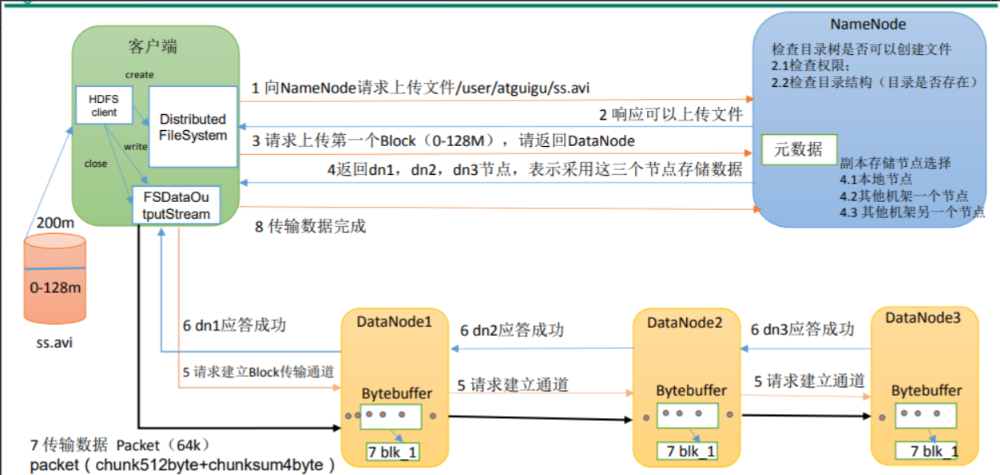
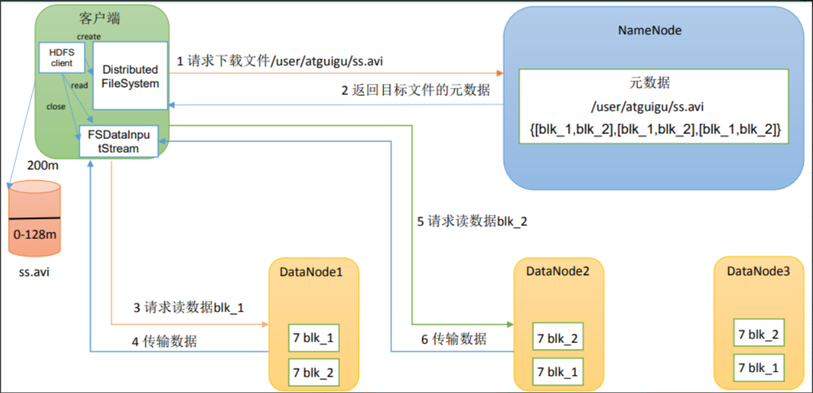

# Hadoop

## 入门

### 1.集群的最主要瓶颈

- 磁盘IO

### 2.Hadoop运行模式✔

- 本地模式/单机模式（Local Mode）
  - 在本地模式下，所有的 Hadoop 组件都在单个 Java 虚拟机（JVM）中运行，不需要启动 Hadoop 集群。这种模式适用于开发和测试，并且通常用于小规模数据处理。
  - 只是用来演示一下官方案例。生产环境不用
- 伪分布式模式（Pseudo-Distributed Mode）
  - 在伪分布式模式下，Hadoop 安装在单个节点上，但每个组件（如 HDFS、YARN 和 MapReduce）都在不同的 JVM 中独立运行。这样使得用户可以模拟一个真实的分布式环境，用于测试和调试。
  - 也是单机运行，但是具备Hadoop集群的所有功能，一台服务器模拟一个分布式的环境。个别缺钱的公司用来测试，生产环境不用。
- 完全分布式模式（Fully-Distributed Mode）
  - 完全分布式模式是 Hadoop 在真实分布式环境中的运行模式。在这种模式下，Hadoop 集群由多个节点组成，每个节点都有自己的角色（如 NameNode、DataNode、ResourceManager、NodeManager 等）。数据和计算任务在整个集群中进行分布和处理。
  - 多台服务器组成分布式环境。生产环境使用。

在完全分布式模式下，Hadoop 集群的架构通常包括一个主节点（Master Node）和多个从节点（Slave Node）。主节点负责管理整个集群，从节点负责存储和处理数据。

通过选择适合你的需求的运行模式，你可以在不同规模和场景下使用 Hadoop 进行大数据处理和分析。

### 3.Hadoop生态圈的组件并做简要描述

1. Zookeeper：**是一个开源的分布式应用程序协调服务**,基于zookeeper可以实现同步服务，配置维护，命名服务。
2. Flume：**一个高可用的，高可靠的，分布式的海量日志采集、聚合和传输的系统。**
3. Hbase：**是一个分布式的、面向列的开源数据库**, 利用Hadoop HDFS作为其存储系统。
4. Hive：**基于Hadoop的一个数据仓库工具**，可以将结构化的数据档映射为一张数据库表，并提供简单的sql 查询功能，可以将sql语句转换为MapReduce任务进行运行。
5. Sqoop：**将一个关系型数据库中的数据导进到Hadoop的 HDFS中，也可以将HDFS的数据导进到关系型数据库中。**

### 4.解释Hadoop和Hadoop生态系统两个概念

- Hadoop是指Hadoop框架本身；
- hadoop生态系统，不仅包含hadoop，还包括保证hadoop框架正常高效运行其他框架，比如zookeeper、Flume、Hbase、Hive、Sqoop等辅助框架。

### 5.请列出正常工作的Hadoop集群中Hadoop都分别需要启动那些进程，它们的作用分别是什么✔

- NameNode

- - 管理DataNode、维护所有文件和目录，以Fsimage+Editlog文件的形式永久保存在磁盘上
  - 记录每个文件所在的节点信息，不保存，启动时会进行重建

- DataNode

- - 存储数据块，受client或NameNode调度
  - 定期向NameNode发送数据块的信息

- SecondAryNameNode`定期合并Editlog和FSimage文件，减少NameNode启动时间`
- Resourcemanager`调度DataNode`

- - 管理集群上资源的使用

- NodeManager`执行任务`

- - 运行在集群中所有节点上的节点管理器

- ZKFC`监控NameNode的状态，写入ZooKeeper中`、
- JournalNode`NameNode的EditLog文件`

### 6.Hadoop常用端口号✔

- hdfs外部通信(webui)	9870`3.x`	50070`2.x`
- hdfs内部通信	8020、9000`2.x`、9820
- yarnwebui	8088（18080）
- 历史服务器	19888

## HDFS

### 7.hdfs数据读写流程✔

1. Client 客户端发送上传请求，**通过 RPC(远程过程调用)与 NameNode 建立通信**，NameNode 检查该用户是否有上传权限，以及上传的文件是否在 HDFS 对应的目录下重名，如果这两者有任意一个不满足，则直接报错，如果两者都满足，则 **返回给客户端**一个可以上传的信息；
2. Client 根据文件的大小进行切分，默认 128M 一块，切分完成之后给 NameNode 发送请求第一个 block 块上传到哪些服务器上
3. NameNode 收到请求之后，根据网络拓扑和机架感知以及副本机制进行文件分配，返回可用的 DataNode 的地址；`Hadoop 在设计时考虑到数据的安全与高效, **数据文件默认在 HDFS 上存放三份, 存储策略为本地一份，同机架内其它某一节点上一份, 不同机架的某一节点上一份。**`
4. 客户端收到地址之后与服务器地址列表中的一个节点如 A 进行通信，本质上就是 RPC 调用，建立 pipeline(通信管道)，A 收到请求后会继续调用 B，B 在调用 C，将整个 pipeline 建立完成，逐级返回 Client；
5. Client 开始向 A 上发送第一个 block**（先从磁盘读取数据然后放到本地内存缓存），以 packet（数据包，64kb）为单位，A 收到一个 packet 就会发送给 B，然后B发送给C，A每传完一个packet就会放入一个应答队列等待应答**
6. 数据被分割成一个个的 packet 数据包在 pipeline 上依次传输***，\*****在pipeline 反向传输中，逐个发送 ack（命令正确应答），**最终由 pipeline 中第一个 DataNode节点A将pipelineack 发送给 Client
7. **当一个block传输完成之后, Client再次请求NameNode上传第二个block， NameNode重新选择三台DataNode给Client。**

1. 

1. Client向NameNode发送RPC请求请求文件block的位置
2. NameNode 收到请求之后会检查用户权限以及是否有这个文件，如果都符合，则会视情况返回部分或全部的 block 列表，对于每个 block，NameNode 都会返回含有该 block 副本的 DataNode 地址；这些返回的 DataNode 地址， 会按照集群拓扑结构得出 DataNode 与客户端的距离，然后进行排序，排序两个规则：网络拓扑结构中距离 Client 近的排靠前；心跳机制中超时 汇报的 DataNode 状态为 STALE，这样的排靠后；
3. Client 选取排序靠前的DataNode来读取block，如果客户端本身就是 DataNode,那么将从本地直接获取数据(**短路读取特性**)
4. 底层上本质是建立SocketStrea（FSDataInputStream），重复的调用父类 DataInputStream的read方法，直到这个块上的数据读取完毕；
5. 当读完列表的block后，若文件读取还没有结束，客户端会继续向 NameNode 获取下一批的block列表；
6. **读取完一个block都会进行 checksum 验证**，如果读取DataNode时出现错误，客户端会通知NameNode，然后再从**下一个拥有该 block 副本的 DataNode 继续读；**
7. **read方法是并行的读取block信息，不是一块一块的读取**；NameNode只是返回 Client请求包含块的DataNode地址，并不是返回请求块的数据
8. **最终读取来所有的 block 会合并成一个完整的最终文件**

### 8.HDFS在读取文件的时候，如果其中一个块突然损坏了怎么办

- 客户端读取完DataNode上的块之后会进行checksum验证，也就是吧客户端读取到本地的块与HDFS上的原始快进行校验，如果发行校验结果不一致，客户端会通知NameNode，然后在从下一个拥有该block副本的DataNode继续读

### 9.HDFS在上传文件的时候，如果其中一个DataNode突然挂掉了怎么办

- 在文件上传时，会进行反方向ack验证，如果DataNode挂掉，客户端就接收不到这个DataNode发送的ack确认，客户端就会通知NameNode，NameNode检查该块的副本与规定的不符，NameNode会通知DataNode去复制副本，并将挂掉的DataNode下线处理，不在让他参与文件的上传与下载。

### 10.NameNode在启动的时候会做哪些操作✔

- 格式化文件系统，生成FSimage文件
- 启动NameNode

- - 读取Fsimage文件，将文件内容加载到内存
  - 等待DataNode发起注册与发送blockreport

- 启动DataNode

- - 向NameNode注册
  - 发送blockreport
  - 检查Fsimage中记录的块的数量与block中块的数量是否一致

- 进行操作（创建、删除文件）
- 第二次启动

- - 读取Fsimage和Editlog文件
  - 将Fsimage和Editlog文件合并成新的Fsimage文件
  - 创建新的Editlog文件，内容开始为空
  - 启动DataNode

### 11.SecondaryNameNode了解吗，它的工作机制是怎样的(数据持久化)✔

- 合并NameNode的Editlog到Fsimage文件中

### 12.SecondaryNameNode不能恢复NameNode的全部数据，那如何保证NameNode数据存储安全(Ha高可用)✔

- 共享存储（元数据信息同步）
- 主备切换

### 13.在NameNodeHa中，会出现脑裂问题吗？怎么解决脑裂

- 调用旧ActivateNameNode的HAServiceProtocolRPC接口的`transitionToStandby`方法
- ssh登录到目标机器上，执行命令fuser将对应的进程杀死

### 14.小文件过多会有什么危害，如何避免

- 内存
- 合并小文件

- 

### 15.请说下HDFS的组织架构

- client

- - 切分文件
  - 与NameNode交互，获取文件位置信息
  - 与DataNode交互，读取或写入数据
  - 管理HDFS

- NameNode

- - 管理HDFS命名空间
  - 管理数据块映射信息
  - 管理副本配置策略
  - 处理客户端读写请求

- DataNode

- - 存储实际的数据块
  - 执行数据块的读写操作

- SecondaryNameNode

- - 辅助NamNode，分担其工作量
  - 定期合并Fsimage和Editlog文件，减少NameNode启动时间
  - 辅助恢复NameNode一部分数据

- - 

### 16.HDFS中的block默认保存几份✔

- 3、

### 17.HSDS默认BlockSize是多大✔

- 【64M--Hadoop2.72】【Hadoop2.73--128M】

## MapReduce

## Yarn

