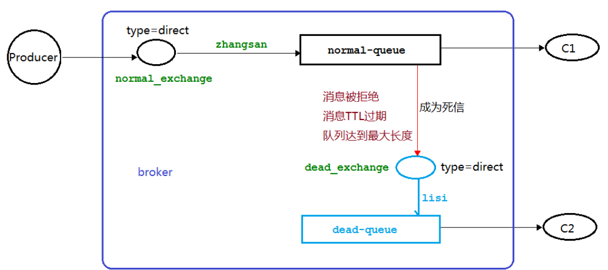
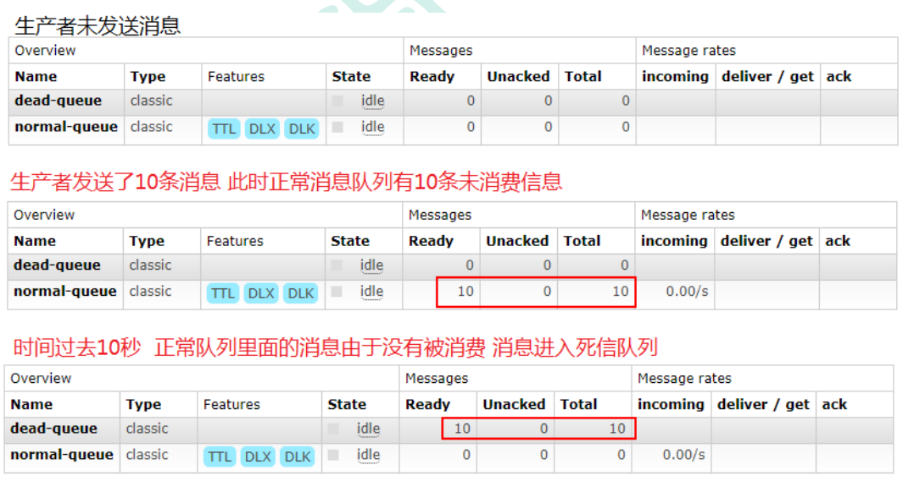
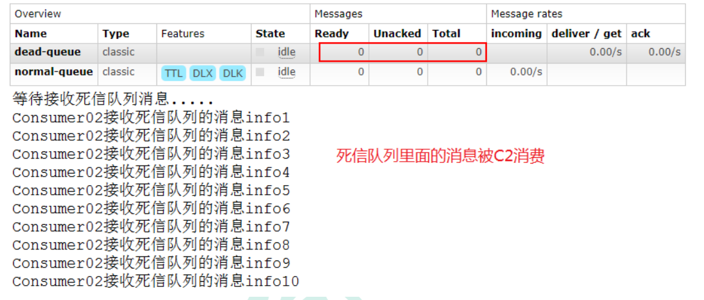
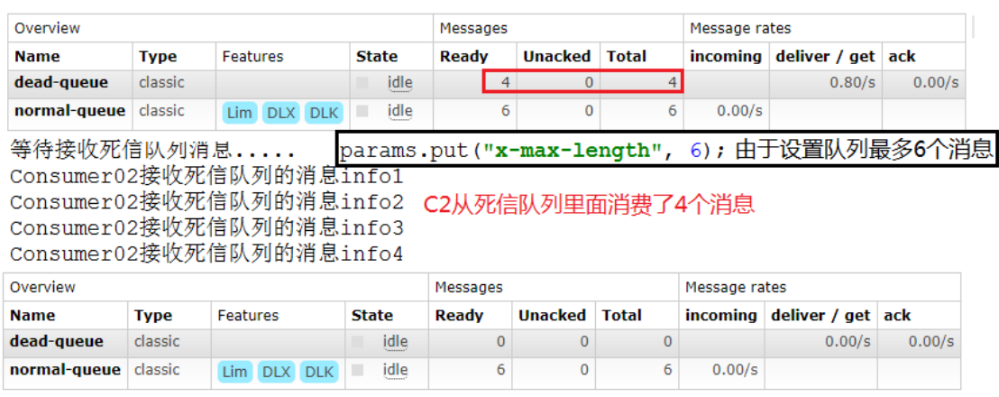
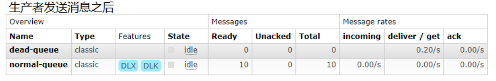
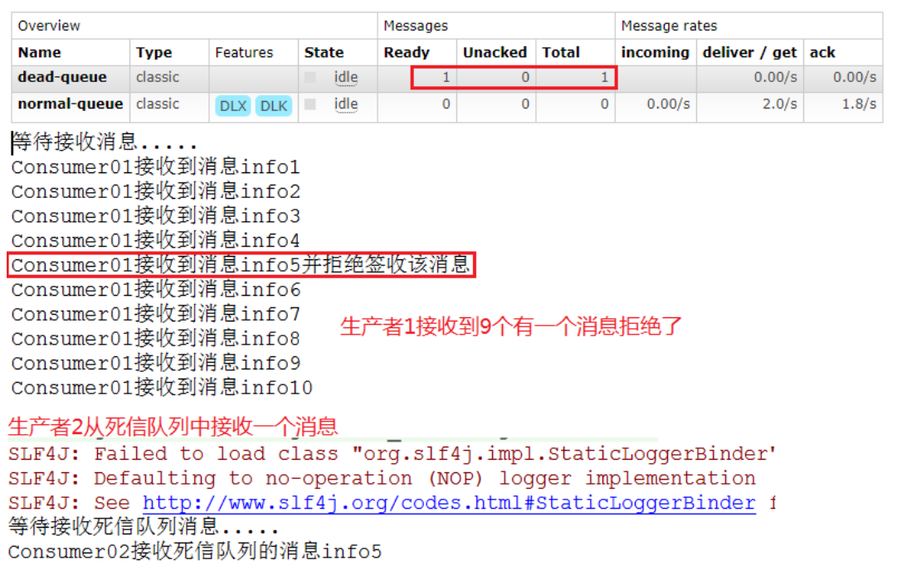

## RabbitMQ-死信队列

### 1. 死信的概念

先从概念解释上搞清楚这个定义，死信，顾名思义就是无法被消费的消息，字面意思可以这样理解，一般来说，
producer 将消息投递到 broker 或者直接到 queue 里了，consumer 从 queue 取出消息进行消费，
但某些时候由于特定的**原因导致 queue 中的某些消息无法被消费**，这样的消息如果没有后续的处理，
就变成了死信，有死信自然就有了死信队列。

应用场景:为了保证订单业务的消息数据不丢失，需要使用到 RabbitMQ 的死信队列机制，当消息
消费发生异常时，将消息投入死信队列中.还有比如说: 用户在商城下单成功并点击去支付后在指定时
间未支付时自动失效

### 2. 死信的来源

- 消息 TTL 过期 
- 队列达到最大长度(队列满了，无法再添加数据到 mq 中)
- 消息被拒绝(basic.reject 或 basic.nack)并且 requeue=false.

### 3. 死信实战

#### 3.1 代码架构图



#### 3.2 消息 TTL 过期

生产者代码

```java
import com.rabbitmq.client.AMQP;
import com.rabbitmq.client.BuiltinExchangeType;
import com.rabbitmq.client.Channel;
import com.tjetc.utils.RabbitMqUtils;
import com.tjetc.utils.SleepUtils;

/**
 * @user 25122
 * @date 2023/5/24
 * @time 14:42
 * @description 死信队列 之 生产者
 */
public class Producer {
    //普通交换机的名称
    public static final String NORMAL_EXCHANGE = "normal_exchange";

    public static void main(String[] args) throws Exception {
        //获取信道
        Channel channel = RabbitMqUtils.getChannel();
        //死信消息 设置TTL 时间 time to live    单位 ms 10000ms=10s 
        AMQP.BasicProperties properties = new AMQP.BasicProperties().builder().expiration("10000").build();
        for (int i = 1; i < 11; i++) {
            String message = "info" + i;
            //发消息   交换机名称，routing key，其他参数，消息 
            channel.basicPublish(NORMAL_EXCHANGE,"zhangsan",properties,message.getBytes("UTF-8"));
//            SleepUtils.sleep(3);
//            System.out.println("正在发送第" + i + "条消息");
            System.out.println("生产者发送消息：" + message);
        }
    }

}

```

消费者C1代码[**启动之后关闭该消费者 模拟其接收不到消息**]

```java
import com.rabbitmq.client.BuiltinExchangeType;
import com.rabbitmq.client.Channel;
import com.rabbitmq.client.DeliverCallback;
import com.tjetc.utils.RabbitMqUtils;

import java.util.HashMap;
import java.util.Map;

/**
 * @user 25122
 * @date 2023/5/24
 * @time 13:58
 * @description 死信队列 实战
 * 消费者 1
 */
public class Consumer01 {
    //普通交换机的名称
    public static final String NORMAL_EXCHANGE = "normal_exchange";
    //死信交换机的名称
    public static final String DEAD_EXCHANGE = "dead_exchange";
    //普通队列的名称
    public static final String NORMAL_QUEUE = "normal_queue";
    //死信队列的名称
    public static final String DEAD_QUEUE = "dead_queue";

    public static void main(String[] args) throws Exception {
        //获取信道
        Channel channel = RabbitMqUtils.getChannel();
        //声明普通和死信交换机 类型为direct  交换机名称，交换机类型
        channel.exchangeDeclare(NORMAL_EXCHANGE, BuiltinExchangeType.DIRECT);
        channel.exchangeDeclare(DEAD_EXCHANGE, BuiltinExchangeType.DIRECT);

        /**
         * 声明普通队列     队列名称，不持久化，不共享，不自动删除，map集合
         */
        Map<String, Object> arguments = new HashMap<>();
        //过期时间  10s=10000ms 【可以不设置，由生产方设置】
//        arguments.put("x-message-ttl",10000);
        //正常队列设置死信交换机   key是固定格式
        arguments.put("x-dead-letter-exchange", DEAD_EXCHANGE);
        //设置死信Routing Key key是固定格式
        arguments.put("x-dead-letter-routing-key", "lisi");
        channel.queueDeclare(NORMAL_QUEUE, false, false, false, arguments);
        //////////////////////////////////////
        /**
         * 声明死信队列    队列名称，不持久化，不共享，不自动删除，其他
         */
        channel.queueDeclare(DEAD_QUEUE, false, false, false, null);
        //绑定普通的交换机与普通的队列
        channel.queueBind(NORMAL_QUEUE, NORMAL_EXCHANGE, "zhangsan");
        //绑定死信的交换机与死信的队列
        channel.queueBind(DEAD_QUEUE, DEAD_EXCHANGE, "lisi");
        System.out.println("等待接收消息。。。");
        //消费成功
        DeliverCallback deliverCallback = (consumerTag, message) -> {
            String msg = new String(message.getBody(), "UTF-8");
                System.out.println("Consumer01接收的消息是：" + msg );
        };
        //消费消息  队列名，自动应答，消费成功，消费失败  ++手动应答
        channel.basicConsume(NORMAL_QUEUE, false, deliverCallback, (consumerTag, message) -> {
        });
    }

}

```



消费者C2代码 (以上步骤完成后 启动 C2 消费者 它消费死信队列里面的消息)

```java
import com.rabbitmq.client.BuiltinExchangeType;
import com.rabbitmq.client.Channel;
import com.rabbitmq.client.DeliverCallback;
import com.tjetc.utils.RabbitMqUtils;

import java.util.HashMap;
import java.util.Map;

/**
 * @user 25122
 * @date 2023/5/24
 * @time 13:59
 * @description 死信队列 实战
 *  消费者 2
 */
public class Consumer02 {


    //死信队列的名称
    public static final String DEAD_QUEUE = "dead_queue";

    public static void main(String[] args) throws Exception{
        //获取信道
        Channel channel = RabbitMqUtils.getChannel();
        System.out.println("等待接收消息。。。");
        //消费成功
        DeliverCallback deliverCallback = (consumerTag, message) -> {
            System.out.println("Consumer02接收的消息是：" + new String(message.getBody(),"UTF-8"));
        };
        //消费消息  队列名，自动应答，消费成功，消费失败
        channel.basicConsume(DEAD_QUEUE,true,deliverCallback,(consumerTag,message)->{});
    }

}

```



#### 3.3 队列达到最大长度

1.消息生产者代码去掉 TTL 属性
```java
import com.rabbitmq.client.AMQP;
import com.rabbitmq.client.BuiltinExchangeType;
import com.rabbitmq.client.Channel;
import com.tjetc.utils.RabbitMqUtils;
import com.tjetc.utils.SleepUtils;

/**
 * @user 25122
 * @date 2023/5/24
 * @time 14:42
 * @description 死信队列 之 生产者
 */
public class Producer {
    //普通交换机的名称
    public static final String NORMAL_EXCHANGE = "normal_exchange";

    public static void main(String[] args) throws Exception {
        //获取信道
        Channel channel = RabbitMqUtils.getChannel();
        for (int i = 1; i < 11; i++) {
            String message = "info" + i;
            channel.basicPublish(NORMAL_EXCHANGE,"zhangsan",null,message.getBytes("UTF-8"));
            System.out.println("生产者发送消息：" + message);
        }
    }

}

```

2. C1 消费者修改以下代码(启动之后关闭该消费者 模拟其接收不到消息)

```java
package com.tjetc.eight;

import com.rabbitmq.client.BuiltinExchangeType;
import com.rabbitmq.client.Channel;
import com.rabbitmq.client.DeliverCallback;
import com.tjetc.utils.RabbitMqUtils;

import java.util.HashMap;
import java.util.Map;

/**
 * @user 25122
 * @date 2023/5/24
 * @time 13:58
 * @description 死信队列 实战
 * 消费者 1
 */
public class Consumer01 {
    //普通交换机的名称
    public static final String NORMAL_EXCHANGE = "normal_exchange";
    //死信交换机的名称
    public static final String DEAD_EXCHANGE = "dead_exchange";
    //普通队列的名称
    public static final String NORMAL_QUEUE = "normal_queue";
    //死信队列的名称
    public static final String DEAD_QUEUE = "dead_queue";

    public static void main(String[] args) throws Exception {
        //获取信道
        Channel channel = RabbitMqUtils.getChannel();
        //声明普通和死信交换机 类型为direct  交换机名称，交换机类型
        channel.exchangeDeclare(NORMAL_EXCHANGE, BuiltinExchangeType.DIRECT);
        channel.exchangeDeclare(DEAD_EXCHANGE, BuiltinExchangeType.DIRECT);

        /**
         * 声明普通队列     队列名称，不持久化，不共享，不自动删除，map集合
         */
        Map<String, Object> arguments = new HashMap<>();
        //过期时间  10s=10000ms 【可以不设置，由生产方设置】
//        arguments.put("x-message-ttl",10000);
        //正常队列设置死信交换机   key是固定格式
        arguments.put("x-dead-letter-exchange", DEAD_EXCHANGE);
        //设置死信Routing Key key是固定格式
        arguments.put("x-dead-letter-routing-key", "lisi");
        //设置正常队列的长度的限制 
        arguments.put("x-max-length",6);
        channel.queueDeclare(NORMAL_QUEUE, false, false, false, arguments);
        //////////////////////////////////////
        /**
         * 声明死信队列    队列名称，不持久化，不共享，不自动删除，其他
         */
        channel.queueDeclare(DEAD_QUEUE, false, false, false, null);
        //绑定普通的交换机与普通的队列
        channel.queueBind(NORMAL_QUEUE, NORMAL_EXCHANGE, "zhangsan");
        //绑定死信的交换机与死信的队列
        channel.queueBind(DEAD_QUEUE, DEAD_EXCHANGE, "lisi");
        System.out.println("等待接收消息。。。");
        //消费成功
        DeliverCallback deliverCallback = (consumerTag, message) -> {
            String msg = new String(message.getBody(), "UTF-8");
            System.out.println("Consumer01接收的消息是：" + msg);
        };
        //消费消息  队列名，自动应答，消费成功，消费失败  ++手动应答
        channel.basicConsume(NORMAL_QUEUE, false, deliverCallback, (consumerTag, message) -> {
        });
    }

}

```

注意此时需要把原先队列删除 因为参数改变了

3. C2 消费者代码不变(启动 C2 消费者)



#### 3.4 消息被拒

1.消息生产者代码同上生产者一致

2.C1 消费者代码(启动之后关闭该消费者 模拟其接收不到消息)

```java
package com.tjetc.eight;

import com.rabbitmq.client.BuiltinExchangeType;
import com.rabbitmq.client.Channel;
import com.rabbitmq.client.DeliverCallback;
import com.tjetc.utils.RabbitMqUtils;

import java.util.HashMap;
import java.util.Map;

/**
 * @user 25122
 * @date 2023/5/24
 * @time 13:58
 * @description 死信队列 实战
 * 消费者 1
 */
public class Consumer01 {
    //普通交换机的名称
    public static final String NORMAL_EXCHANGE = "normal_exchange";
    //死信交换机的名称
    public static final String DEAD_EXCHANGE = "dead_exchange";
    //普通队列的名称
    public static final String NORMAL_QUEUE = "normal_queue";
    //死信队列的名称
    public static final String DEAD_QUEUE = "dead_queue";

    public static void main(String[] args) throws Exception {
        //获取信道
        Channel channel = RabbitMqUtils.getChannel();
        //声明普通和死信交换机 类型为direct  交换机名称，交换机类型
        channel.exchangeDeclare(NORMAL_EXCHANGE, BuiltinExchangeType.DIRECT);
        channel.exchangeDeclare(DEAD_EXCHANGE, BuiltinExchangeType.DIRECT);

        /**
         * 声明普通队列     队列名称，不持久化，不共享，不自动删除，map集合
         */
        Map<String, Object> arguments = new HashMap<>();
        //过期时间  10s=10000ms 【可以不设置，由生产方设置】
//        arguments.put("x-message-ttl",10000);
        //正常队列设置死信交换机   key是固定格式
        arguments.put("x-dead-letter-exchange", DEAD_EXCHANGE);
        //设置死信Routing Key key是固定格式
        arguments.put("x-dead-letter-routing-key", "lisi");
        channel.queueDeclare(NORMAL_QUEUE, false, false, false, arguments);
        //////////////////////////////////////
        /**
         * 声明死信队列    队列名称，不持久化，不共享，不自动删除，其他
         */
        channel.queueDeclare(DEAD_QUEUE, false, false, false, null);
        //绑定普通的交换机与普通的队列
        channel.queueBind(NORMAL_QUEUE, NORMAL_EXCHANGE, "zhangsan");
        //绑定死信的交换机与死信的队列
        channel.queueBind(DEAD_QUEUE, DEAD_EXCHANGE, "lisi");
        System.out.println("等待接收消息。。。");
        //消费成功
        DeliverCallback deliverCallback = (consumerTag, message) -> {
            String msg = new String(message.getBody(), "UTF-8");
            //拒绝消息 
            if (msg.equals("info5")) {
                System.out.println("Consumer01接收的消息是：" + msg + "：此消息是被C1拒绝的");
                channel.basicReject(message.getEnvelope().getDeliveryTag(), false);//false 不放回队列++
            } else {
                System.out.println("Consumer01接收的消息是：" + msg);
                channel.basicAck(message.getEnvelope().getDeliveryTag(),false);//false 不批量应答++
            }
        };
        //消费消息  队列名，自动应答，消费成功，消费失败  ++手动应答
        channel.basicConsume(NORMAL_QUEUE, false, deliverCallback, (consumerTag, message) -> {
        });
    }

}

```



3. C2 消费者代码不变

启动消费者 1 然后再启动消费者 2


