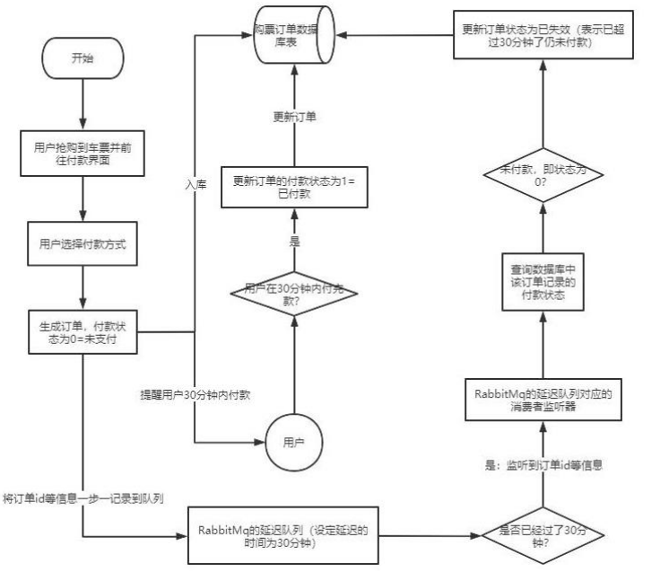
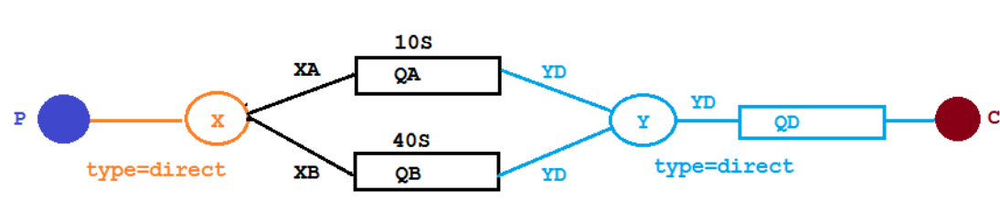
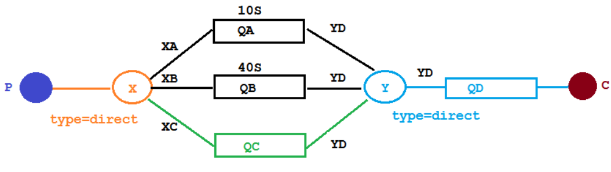
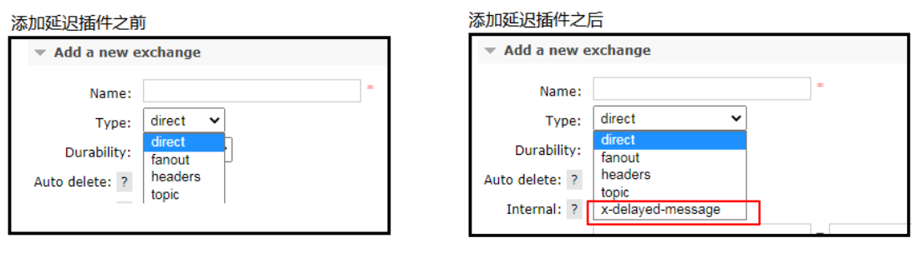
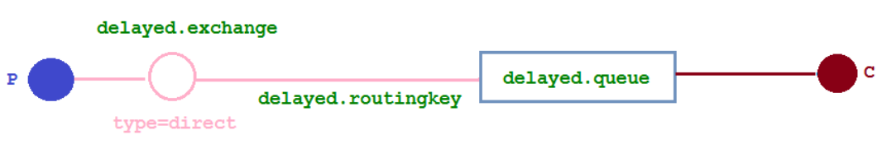
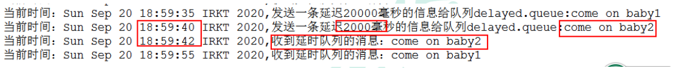

## RabbitMQ-延迟队列

### 1. 延迟队列的概念

延时队列,队列内部是有序的，最重要的特性就体现在它的延时属性上，延时队列中的元素是希望在指定时间到了以后或之前取出和处理，
简单来说，延时队列就是用来存放需要在指定时间被处理的元素的队列。

### 2. 延迟队列使用场景

1.订单在十分钟之内未支付则自动取消

2.新创建的店铺，如果在十天内都没有上传过商品，则自动发送消息提醒。

3.用户注册成功后，如果三天内没有登陆则进行短信提醒。

4.用户发起退款，如果三天内没有得到处理则通知相关运营人员。

5.预定会议后，需要在预定的时间点前十分钟通知各个与会人员参加会议

这些场景都有一个特点，需要在某个事件发生之后或者之前的指定时间点完成某一项任务，如：发生订单生成事件，在十分钟之后检查该订单支付状态，
然后将未支付的订单进行关闭；看起来似乎使用定时任务，一直轮询数据，每秒查一次，取出需要被处理的数据，然后处理不就完事了吗？如果数据量比较少，
确实可以这样做，比如：对于“如果账单一周内未支付则进行自动结算”这样的需求，如果对于时间不是严格限制，而是宽松意义上的一周，
那么每天晚上跑个定时任务检查一下所有未支付的账单，确实也是一个可行的方案。但对于数据量比较大，并且时效性较强的场景，
如：“订单十分钟内未支付则关闭“，短期内未支付的订单数据可能会有很多，活动期间甚至会达到百万甚至千万级别，
对这么庞大的数据量仍旧使用轮询的方式显然是不可取的，很可能在一秒内无法完成所有订单的检查，同时会给数据库带来很大压力，无法满足业务要求而且性能低下。



### 3. RabbitMQ 中的 TTL

TTL 是什么呢？TTL 是 RabbitMQ 中一个消息或者队列的属性，表明一条消息或者该队列中的所有消息的最大存活时间，

单位是毫秒。换句话说，如果一条消息设置了 TTL 属性或者进入了设置 TTL 属性的队列，那么这条消息如果在 TTL 设置的时间内没有被消费，
则会成为"死信"。如果同时配置了队列的 TTL 和消息的 TTL，那么较小的那个值将会被使用，有两种方式设置 TTL。

#### 3.1 消息设置TTL

另一种方式便是针对每条消息设置 TTL

```java
    /**
     * 开始发消息
     * @param message 消息
     * @param ttlTime TTL
     */
    @GetMapping("sendExpirationMsg/{message}/{ttlTime}")
    public void sendMsg(@PathVariable String message,@PathVariable String ttlTime){
        this.rabbitTemplate.convertAndSend("X","XC",message,msg -> {
            //发送消息的时候 延迟时长
            msg.getMessageProperties().setExpiration(ttlTime);//设置TTL
            return msg;
        });
    }
```

#### 3.2 队列设置TTL

第一种是在创建队列的时候设置队列的“x-message-ttl”属性

```java
        //设置过期时间TTL 单位是ms
        arguments.put("x-message-ttl", 10000);
        return QueueBuilder
                .durable(QUEUE_A)
                .withArguments(arguments)
                .build();
```

#### 3.3 两者的区别

如果设置了队列的 TTL 属性，那么一旦消息过期，就会被队列丢弃(如果配置了死信队列被丢到死信队列中)，
而第二种方式，消息即使过期，也不一定会被马上丢弃，**因为消息是否过期是在即将投递到消费者之前判定的，
**如果当前队列有严重的消息积压情况，则已过期的消息也许还能存活较长时间；另外，还需要注意的一点是，
如果不设置 TTL，表示消息永远不会过期，如果将 TTL 设置为 0，则表示除非此时可以直接投递该消息到消费者，否则该消息将会被丢弃。

前一小节我们介绍了死信队列，刚刚又介绍了 TTL，至此利用 RabbitMQ 实现延时队列的两大要素已经集齐，接下来只需要将它们进行融合，
再加入一点点调味料，延时队列就可以新鲜出炉了。想想看，延时队列，不就是想要消息延迟多久被处理吗，TTL 则刚好能让消息在延迟多久之后成为死信，另一方面，
成为死信的消息都会被投递到死信队列里，这样只需要消费者一直消费死信队列里的消息就完事了，因为里面的消息都是希望被立即处理的消息。


### 4. 整合SpringBoot

#### 4.1 创建SpringBoot项目工程

#### 4.2 添加依赖

```xml
 <dependencies>
        <dependency>
            <groupId>org.springframework.boot</groupId>
            <artifactId>spring-boot-starter</artifactId>
        </dependency>

        <dependency>
            <groupId>org.springframework.boot</groupId>
            <artifactId>spring-boot-starter-test</artifactId>
            <scope>test</scope>
        </dependency>

        <!--RabbitMQ 依赖-->
        <dependency>
            <groupId>org.springframework.boot</groupId>
            <artifactId>spring-boot-starter-amqp</artifactId>
        </dependency>
        <dependency>
            <groupId>org.springframework.boot</groupId>
            <artifactId>spring-boot-starter-web</artifactId>
        </dependency>

        <dependency>
            <groupId>com.alibaba</groupId>
            <artifactId>fastjson</artifactId>
            <version>1.2.47</version>
        </dependency>
        <dependency>
            <groupId>org.projectlombok</groupId>
            <artifactId>lombok</artifactId>
        </dependency>
        <!--knife4j-->
        <dependency>
            <groupId>com.github.xiaoymin</groupId>
            <artifactId>knife4j-spring-boot-starter</artifactId>
            <version>3.0.3</version>
        </dependency>
        <!--RabbitMQ 测试依赖-->
        <dependency>
            <groupId>org.springframework.amqp</groupId>
            <artifactId>spring-rabbit-test</artifactId>
            <scope>test</scope>
        </dependency>

    </dependencies>

```

#### 4.3 修改配置文件

applcation.yml
```yml
spring:
  rabbitmq:
    host: 192.168.137.50
    port: 5672
    username: admin
    password: 123
```

#### 4.4 添加 Knife4j 配置类

[knife4j官网地址](https://doc.xiaominfo.com/)

```java
package com.tjetc.springbootrabbitmq.config;

import org.springframework.context.annotation.Bean;
import org.springframework.context.annotation.Configuration;
import springfox.documentation.builders.ApiInfoBuilder;
import springfox.documentation.builders.PathSelectors;
import springfox.documentation.builders.RequestHandlerSelectors;
import springfox.documentation.service.Contact;
import springfox.documentation.spi.DocumentationType;
import springfox.documentation.spring.web.plugins.Docket;
import springfox.documentation.swagger2.annotations.EnableSwagger2WebMvc;

@Configuration
@EnableSwagger2WebMvc
public class Knife4jConfiguration {

    @Bean(value = "defaultApi2")
    public Docket defaultApi2() {
        Docket docket=new Docket(DocumentationType.SWAGGER_2)
                .apiInfo(new ApiInfoBuilder()
                        .title("RabbitMQ接口文档")
                        .description("本文档描述了RabbitMQ微服务接口定义")
                        .termsOfServiceUrl("http://www.xx.com/")
                        .contact(new Contact("lxy25122","www.lxy25122.com","lxy25122@163.com"))
                        .version("1.0")
                        .build())
                //分组名称
                .groupName("2.X版本")
                .select()
                //这里指定Controller扫描包路径
                .apis(RequestHandlerSelectors.basePackage("com.github.xiaoymin.knife4j.controller"))
                .paths(PathSelectors.any())
                .build();
        return docket;
    }
}
```

### 5. 队列TTL

#### 5.1 代码架构图

创建两个队列 QA 和 QB，两者队列 TTL 分别设置为 10S 和 40S，然后在创建一个交换机 X 和死信交换机 Y，
它们的类型都是 direct，创建一个死信队列 QD，它们的绑定关系如下：



#### 5.2 配置文件类代码

- TtlQueueConfig 

```java
    package com.tjetc.springbootrabbitmq.config;

import org.springframework.amqp.core.*;
import org.springframework.beans.factory.annotation.Qualifier;
import org.springframework.context.annotation.Bean;
import org.springframework.context.annotation.Configuration;

import java.util.HashMap;
import java.util.Map;

/**
 * @user 25122
 * @date 2023/5/25
 * @time 13:53
 * @description TTL 队列 配置日志文件类代码
 */
@Configuration//实例化
public class TtlQueueConfig {
    //普通交换机的名称
    public static final String X_EXCHANGE = "X";
    //死信交换机的名称
    public static final String Y_DEAD_LETTER_EXCHANGE = "Y";
    //空的队列的名称
    public static final String QUEUE_A = "QA";
    public static final String QUEUE_B = "QB";

    //普通队列的名称
    public static final String QUEUE_C = "QC";


    /**
     * 声明交换机 x 和 y
     * @return
     */
    //声明 xExchange 交换机 别名
    @Bean("xExchange")
    public DirectExchange xExchange() {
        return new DirectExchange(X_EXCHANGE);
    }

    //声明 yExchange 交换机 别名
    @Bean("yExchange")
    public DirectExchange yExchange() {
        return new DirectExchange(Y_DEAD_LETTER_EXCHANGE);
    }

    /**
     * 声明普通队列 TTL为10s qa
     * qd
     */
    @Bean("queueA")
    public Queue queueA() {
        Map<String, Object> arguments = new HashMap<>(3);
        //设置死信交换机
        arguments.put("x-dead-letter-exchange", Y_DEAD_LETTER_EXCHANGE);
        //设置死信routing key
        arguments.put("x-dead-letter-routing-key", "YD");
        //设置过期时间TTL 单位是ms
        arguments.put("x-message-ttl", 10000);
        return QueueBuilder
                .durable(QUEUE_A)
                .withArguments(arguments)
                .build();
    }

    /**
     * 声明普通队列 TTL为40s  qb
     */
    @Bean("queueB")
    public Queue queueB() {
        Map<String, Object> arguments = new HashMap<>(3);
        //设置死信交换机
        arguments.put("x-dead-letter-exchange", Y_DEAD_LETTER_EXCHANGE);
        //设置死信routing key
        arguments.put("x-dead-letter-routing-key", "YD");
        //设置过期时间TTL 单位是ms
        arguments.put("x-message-ttl", 40000);
        return QueueBuilder
                .durable(QUEUE_B)
                .withArguments(arguments)
                .build();
    }

    /**
     * 声明死信队列  qd
     */
    @Bean("queueD")
    public Queue queueD() {
        return QueueBuilder.durable(DEAD_LETTER_QUEUE_D).build();
    }

    /**
     * 队列 QA 绑定 X 交换机
     * @param queueA
     * @param xExchange
     * @return
     */
    @Bean
    public Binding queueABindingX(@org.springframework.beans.factory.annotation.Qualifier("queueA") Queue queueA,
                                  @org.springframework.beans.factory.annotation.Qualifier("xExchange") DirectExchange xExchange){
        return BindingBuilder.bind(queueA).to(xExchange).with("XA");
    }

    /**
     * 队列 QB 绑定 X交换机
     * @param queueB
     * @param xExchange
     * @return
     */
    @Bean
    public Binding queuBBindingX(@org.springframework.beans.factory.annotation.Qualifier("queueB") Queue queueB,
                                 @org.springframework.beans.factory.annotation.Qualifier("xExchange") DirectExchange xExchange){
        return BindingBuilder.bind(queueB).to(xExchange).with("XB");
    }
    
    /**
     * 队列 QD 绑定 Y交换机
     * @param queueD
     * @param yExchange
     * @return
     */
    @Bean
    public Binding queuDBindingY(@org.springframework.beans.factory.annotation.Qualifier("queueD") Queue queueD,
                                 @org.springframework.beans.factory.annotation.Qualifier("yExchange") DirectExchange yExchange){
        return BindingBuilder.bind(queueD).to(yExchange).with("YD");
    }

}

```

#### 5.3 消息生产者代码

- SendMsgController

```java
package com.tjetc.springbootrabbitmq.controller;

import lombok.extern.slf4j.Slf4j;
import org.springframework.amqp.rabbit.core.RabbitTemplate;
import org.springframework.beans.factory.annotation.Autowired;
import org.springframework.web.bind.annotation.GetMapping;
import org.springframework.web.bind.annotation.PathVariable;
import org.springframework.web.bind.annotation.RequestMapping;
import org.springframework.web.bind.annotation.RestController;

import java.util.Date;

/**
 * @user 25122
 * @date 2023/5/25
 * @time 14:32
 * @description 发送延迟消息 10s 40s
 */
@RestController
@RequestMapping("/ttl")
@Slf4j
public class SendMsgController {

    @Autowired
    private RabbitTemplate rabbitTemplate;

    /**
     * 开始发消息
     * @param message
     * @return
     */
    @GetMapping("sendMsg/{message}")
    public String sendMsg(@PathVariable String message){
        log.info("当前时间：{}，发送一条信息给两个TTL队列：{}",new Date().toString(),message);
        //发送消息
        this.rabbitTemplate.convertAndSend("X","XA","消息来自TTL为10s的队列：" + message);
        this.rabbitTemplate.convertAndSend("X","XB","消息来自TTL为40s的队列：" + message);
        return "当前时间：" + new Date().toString() + "，发送一条信息给两个TTL队列：" + message;
    }

}

```

#### 5.4 消息消费者代码

```java
package com.tjetc.springbootrabbitmq.consumer;

import com.rabbitmq.client.Channel;
import lombok.extern.slf4j.Slf4j;
import org.springframework.amqp.core.Message;
import org.springframework.amqp.rabbit.annotation.RabbitListener;
import org.springframework.stereotype.Component;

import java.util.Date;

/**
 * @user 25122
 * @date 2023/5/25
 * @time 14:40
 * @description 队列TTL 消费者
 */
@Slf4j
@Component
public class DeadLetterQueueConsumer {

    /**
     * 接收消息
     *
     * @param message 消息
     * @param channel 信道
     * @throws Exception
     */
    @RabbitListener(queues = "QD")
    public void receiveD(Message message, Channel channel) throws Exception{
        //获得消息
        String msg = new String(message.getBody());
        //打印
        log.info("当前时间：{}，收到死信队列的消息：{}",new Date().toString(),msg);
    }

}

```

发起一个请求 http://localhost:80/ttl/sendMsg/嘻嘻嘻

观察控制台 时间 变化

第一条消息在 10S 后变成了死信消息，然后被消费者消费掉，第二条消息在 40S 之后变成了死信消息，然后被消费掉，这样一个延时队列就打造完成了。

不过，如果这样使用的话，岂不是每增加一个新的时间需求，就要新增一个队列，这里只有 10S 和 40S 两个时间选项，如果需要一个小时后处理，
那么就需要增加 TTL 为一个小时的队列，如果是预定会议室然后提前通知这样的场景，岂不是要增加无数个队列才能满足需求？

### 6. 延时队列优化

#### 6.1 代码架构图

在这里新增了一个队列 QC,绑定关系如下,该队列不设置 TTL 时间



#### 6.2 配置文件类代码

- TtlQueueConfig 依旧写在这个配置类中

```java
package com.tjetc.springbootrabbitmq.config;

import org.springframework.amqp.core.*;
import org.springframework.beans.factory.annotation.Qualifier;
import org.springframework.context.annotation.Bean;
import org.springframework.context.annotation.Configuration;

import java.util.HashMap;
import java.util.Map;

/**
 * @user 25122
 * @date 2023/5/25
 * @time 13:53
 * @description TTL 队列 配置日志文件类代码
 */
@Configuration//实例化
public class TtlQueueConfig {

    //死信交换机的名称
    public static final String Y_DEAD_LETTER_EXCHANGE = "Y";

    //普通队列的名称
    public static final String QUEUE_C = "QC";
    
    /**
     * 声明普通队列   qc
     */
    @Bean("queueC")
    public Queue queueC(){
        Map<String, Object> arguments = new HashMap<>(3);
        //设置死信交换机
        arguments.put("x-dead-letter-exchange",Y_DEAD_LETTER_EXCHANGE);
        //设置死信routing key
        arguments.put("x-dead-letter-routing-key","YD");
        return QueueBuilder.durable().withArguments(arguments).build();
    }
    
    
    /**
     * 队列 QC 绑定 X交换机
     * @param queueC
     * @param xExchange
     * @return
     */
    @Bean
    public Binding queueCBindingX(@Qualifier("queueC") Queue queueC,
                                  @Qualifier("xExchange") DirectExchange xExchange){
        return BindingBuilder.bind(queueC).to(xExchange).with("XC");
    }
    
}

```

#### 6.3 消息生产者代码

- SendMsgController

```java
package com.tjetc.springbootrabbitmq.controller;

import lombok.extern.slf4j.Slf4j;
import org.springframework.amqp.rabbit.core.RabbitTemplate;
import org.springframework.beans.factory.annotation.Autowired;
import org.springframework.web.bind.annotation.GetMapping;
import org.springframework.web.bind.annotation.PathVariable;
import org.springframework.web.bind.annotation.RequestMapping;
import org.springframework.web.bind.annotation.RestController;

import java.util.Date;

/**
 * @user 25122
 * @date 2023/5/25
 * @time 14:32
 * @description 发送延迟消息 10s 40s
 */
@RestController
@RequestMapping("/ttl")
@Slf4j
public class SendMsgController {

    @Autowired
    private RabbitTemplate rabbitTemplate;

    /**
     * 开始发消息
     * @param message 消息
     * @param ttlTime TTL
     */
    @GetMapping("sendExpirationMsg/{message}/{ttlTime}")
    public String sendMsg(@PathVariable String message,@PathVariable String ttlTime){
        log.info("当前时间：{}，发送一条时长{}毫秒TTL信息给队列QC：{}",new Date().toString(),ttlTime,message);
        this.rabbitTemplate.convertAndSend("X","XC",message,msg -> {
            //发送消息的时候 延迟时长
            msg.getMessageProperties().setExpiration(ttlTime);
            return msg;
        });
        return "当前时间：" + new Date().toString() + "，发送一条时长" + ttlTime + "毫秒TTL信息给队列QC：" + message;
    }

}

```

发起请求
http://localhost:80/ttl/sendExpirationMsg/你好 1/20000
http://localhost:80/ttl/sendExpirationMsg/你好 2/2000

观察控制台打印时间

看起来似乎没什么问题，但是在最开始的时候，就介绍过如果使用在消息属性上设置 TTL 的方式，消息可能并不会按时“死亡“，
**因为 RabbitMQ 只会检查第一个消息是否过期，如果过期则丢到死信队列，如果第一个消息的延时时长很长，而第二个消息的延时时长很短，第二个消息并不会优先得到执行。**

### 7. Rabbitmq 插件实现延迟队列

上文中提到的问题，确实是一个问题，如果不能实现在消息粒度上的 TTL，并使其在设置的 TTL 时间
及时死亡，就无法设计成一个通用的延时队列。那如何解决呢，接下来我们就去解决该问题。

#### 7.1 安装延时队列插件

在官网上下载 https://www.rabbitmq.com/community-plugins.html，下载**rabbitmq_delayed_message_exchange** 插件，然后解压放置到 RabbitMQ 的插件目录。
进入 RabbitMQ 的安装目录下的 plgins 目录，执行下面命令让该插件生效，然后重启 RabbitMQ 

/usr/lib/rabbitmq/lib/rabbitmq_server-3.8.8/plugins

rabbitmq-plugins enable rabbitmq_delayed_message_exchange

停止/sbin/service rabbitmq-server stop

开启/sbin/service rabbitmq-server start

观察webui界面



#### 7.2 代码架构图 

在这里新增了一个队列 delayed.queue,一个自定义交换机 delayed.exchange，绑定关系如下



#### 7.3 配置文件类代码

在我们自定义的交换机中，这是一种新的交换类型，该类型消息支持延迟投递机制 消息传递后并
不会立即投递到目标队列中，而是存储在 mnesia(一个分布式数据系统)表中，当达到投递时间时，才
投递到目标队列中。

- DelayedQueueConfig

```java
package com.tjetc.springbootrabbitmq.config;

import org.springframework.amqp.core.Binding;
import org.springframework.amqp.core.BindingBuilder;
import org.springframework.amqp.core.CustomExchange;
import org.springframework.amqp.core.Queue;
import org.springframework.beans.factory.annotation.Qualifier;
import org.springframework.context.annotation.Bean;
import org.springframework.context.annotation.Configuration;

import java.util.HashMap;
import java.util.Map;


/**
 * @user 25122
 * @date 2023/5/25
 * @time 16:49
 * @description
 */
@Configuration//实例化
public class DelayedQueueConfig {

    //队列
    public static final String DELAYED_QUEUE_NAME = "delayed.queue";
    //交换机
    public static final String DELAYED_EXCHANGE_NAME = "delayed.exchange";
    //routing key
    public static final String DELAYED_ROUTING_KEY = "delayed.routingkey";

    /**
     * 声明队列
     * @return
     */
    @Bean
    public Queue delayedQueue(){
        return new Queue(DELAYED_QUEUE_NAME);
    }

    /***
     * 声明交换机 自定义交换机CustomExchange
     * 基于插件的
     */
    @Bean
    public CustomExchange delayedExchange(){
        Map<String, Object> arguments = new HashMap<>();
        //延迟类型
        arguments.put("x-delayed-type","direct");
        /**
         *  1.交换机名称
         *  2.交换机类型
         *  3.是否需要持久化
         *  4.是否需要自动删除
         *  5. 其他
         */
        return new CustomExchange(DELAYED_EXCHANGE_NAME,"x-delayed-message",true,false,arguments);
    }

    /****
     * 榜定交换机和队列
     * @param delayQueue 自定义 就是 方法名
     * @param delayedExchange
     * @return
     */
    @Bean
    public Binding delayedQueueBindingDelayedExchange(@Qualifier("delayedQueue")Queue delayQueue,
                                                      @Qualifier("delayedExchange")CustomExchange delayedExchange){
        return BindingBuilder.bind(delayQueue).to(delayedExchange).with(DELAYED_ROUTING_KEY).noargs();
    }

}

```

#### 7.4 消息生产者

```java
 /***
     * 开始发消息 基于插件的 消息 及 延迟的时间
     * @param message
     * @param delayTime
     */
    @ApiOperation("基于插件的自定义延迟时间的消息")
    @GetMapping("sendDelayMsg/{message}/{delayTime}")
    public String sendMsg(@PathVariable String message,@PathVariable Integer delayTime){
        log.info("当前时间：{}，发送一条时长{}毫秒信息给延迟队列delayed.queue：{}",new Date().toString(),delayTime,message);
        this.rabbitTemplate.convertAndSend(DelayedQueueConfig.DELAYED_EXCHANGE_NAME,DelayedQueueConfig.DELAYED_ROUTING_KEY,message, msg -> {
            //发送消息的时候 延迟时长 单位ms
            msg.getMessageProperties().setDelay(delayTime);
            return msg;
        });
        return "当前时间：" + new Date().toString() + "，发送一条时长" + delayTime + "毫秒信息给队列delayed.queue：" + message;
    }
```

#### 7.5 消息消费者

- DelayQueueConsumer

```java
package com.tjetc.springbootrabbitmq.consumer;

import com.tjetc.springbootrabbitmq.config.DelayedQueueConfig;
import lombok.extern.slf4j.Slf4j;
import org.springframework.amqp.core.Message;
import org.springframework.amqp.rabbit.annotation.RabbitListener;
import org.springframework.context.annotation.Configuration;
import org.springframework.stereotype.Component;

import java.util.Date;

/**
 * @user 25122
 * @date 2023/5/26
 * @time 15:38
 * @description 消费者 基于插件的延迟消息
 */
@Slf4j
@Component//实例化
public class DelayQueueConsumer {

    /***
     * 监听消息
     * @param message
     */
    @RabbitListener(queues = DelayedQueueConfig.DELAYED_QUEUE_NAME)
    public void receiveDelayQueue(Message message){
        String msg = new String(message.getBody());
        log.info("当前时间：{}，收到延迟队列的消息：{}",new Date().toString(), msg);
    }

}

```

发起请求：

http://localhost:80/ttl/sendDelayMsg/come on baby1/20000

http://localhost:80/ttl/sendDelayMsg/come on baby2/2000



第二个消息被先消费掉了，符合预期

### 8. 总结

延时队列在需要延时处理的场景下非常有用，使用 RabbitMQ 来实现延时队列可以很好的利用RabbitMQ 的特性，如：消息可靠发送、消息可靠投递、死信队列来保障消息至少被消费一次以及未被正
确处理的消息不会被丢弃。另外，通过 RabbitMQ 集群的特性，可以很好的解决单点故障问题，不会因为单个节点挂掉导致延时队列不可用或者消息丢失。

当然，延时队列还有很多其它选择，比如利用 Java 的 DelayQueue，利用 Redis 的 zset，利用 Quartz或者利用 kafka 的时间轮，这些方式各有特点,看需要适用的场景


